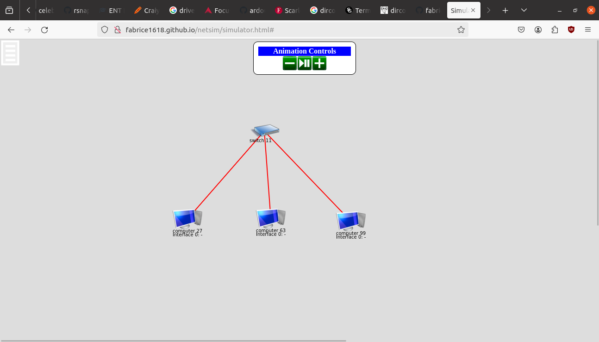
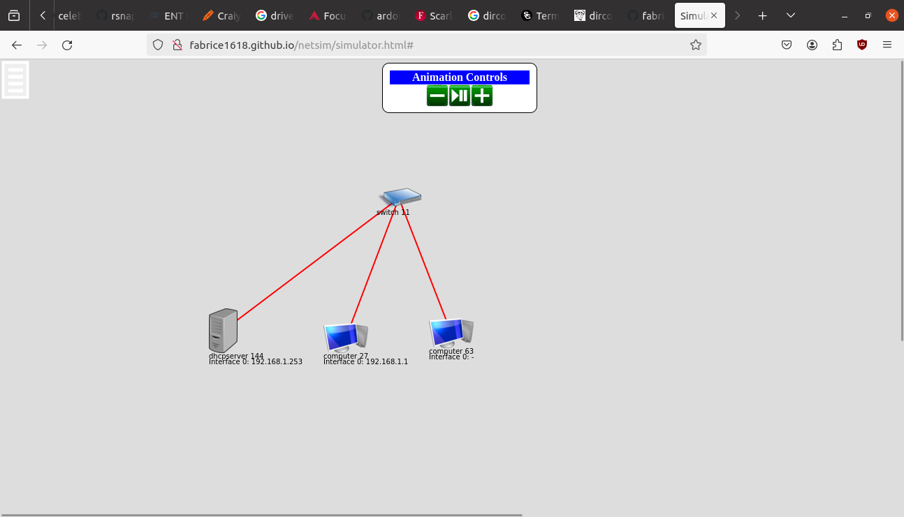
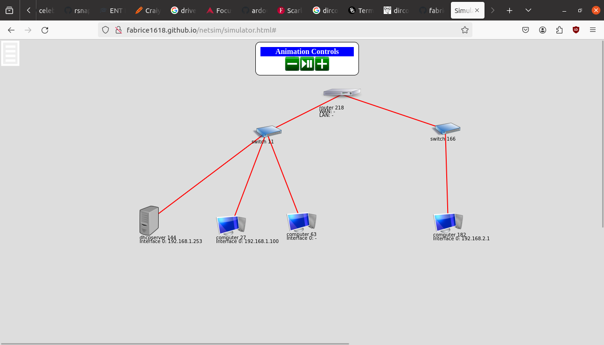
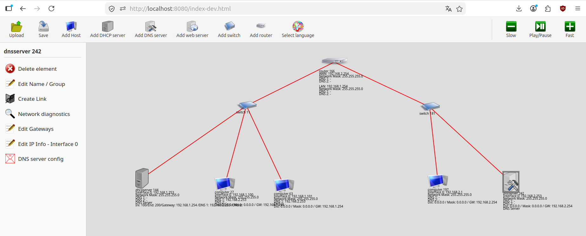
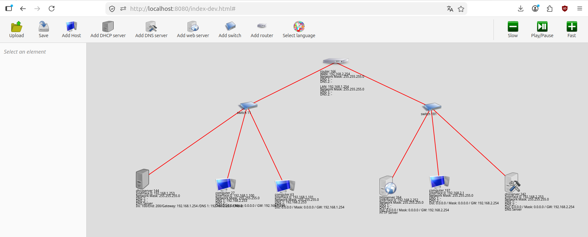

# TP Netsim : Simulateur Réseau

## Objectifs du TP

A la fin de ce TP, vous serez capable de :

- Configurer des adresses IP statiques sur des machines
- Calculer une adresse réseau à partir d'une adresse IP et d'un masque de sous-réseau
- Comprendre pourquoi deux machines d'un même réseau peuvent communiquer entre elles
- Mettre en place un serveur DHCP pour attribuer automatiquement des adresses IP
- Configurer un routeur pour interconnecter deux sous-réseaux différents
- Mettre en place un serveur DNS pour résoudre des noms de domaine en adresses IP
- Configurer un serveur web et publier des pages HTML accessibles par nom de domaine
- Utiliser la commande `ping` pour tester la connectivité réseau

## Prérequis

- Notions de base sur les réseaux informatiques (adresse IP, masque de sous-réseau)
- Navigateur web récent (Chrome, Firefox, Edge)

## Présentation du simulateur Netsim

Netsim est un simulateur réseau en ligne qui permet de construire et tester des topologies réseau simples directement dans votre navigateur.

**Accès au simulateur :** [https://fabrice1618.github.io/netsim3/](https://fabrice1618.github.io/netsim3/)

### Eléments disponibles dans le simulateur

| Elément | Description |
|---------|-------------|
| **Computer** | Un ordinateur avec une interface réseau (interface 0) |
| **Switch** | Un commutateur réseau qui relie plusieurs machines d'un même réseau local |
| **Router** | Un routeur avec deux interfaces (interface 0 et interface 1) pour interconnecter deux réseaux |
| **DHCP Server** | Un serveur DHCP qui attribue automatiquement des adresses IP aux machines |

### Comment utiliser le simulateur

1. **Ajouter un élément** : Cliquer sur le menu en haut à gauche, puis sélectionner le type d'élément à ajouter
2. **Connecter deux éléments** : Cliquer sur un élément sur le menu en haut à droite, puis sur create link, puis sur un deuxième élément pour créer un câble réseau entre eux
3. **Configurer un élément** : Faire un clic droit sur l'élément pour accéder au menu contextuel :
   - **"edit IP info - interface 0"** : configurer l'adresse IP et le masque de sous-réseau
   - **"network diagnostics"** : lancer un ping vers une autre machine
   - **"edit DHCP server info"** : configurer la plage d'adresses du serveur DHCP
   - **"request DHCP info"** : demander une adresse IP au serveur DHCP
   - **"edit gateways"** : configurer la passerelle par défaut (gateway)
4. **Supprimer un élément** : Cliquer sur le menu en haut à droite de l'élément, puis cliquer sur delete element
5. **Sauvegarder la topologie** : Cliquer sur le menu en haut à gauche, puis sélectionner **save**. Pensez à sauvegarder régulièrement votre travail !
6. **Animation Controls** : Le panneau "Animation Controls" permet de contrôler la visualisation des échanges réseau :
   - Boutons **[+]** et **[-]** : augmenter ou diminuer la vitesse de l'animation
   - Bouton **play/pause** : démarrer ou mettre en pause l'animation

> **Conseil** : Si une animation ne se lance pas (par exemple après un ping), essayez de cliquer sur le bouton **play/pause** pour relancer l'animation.

---

## Rappels : Concepts réseau utilisés

### Adresse IP et masque de sous-réseau

Une **adresse IP** (version 4) est composée de 4 octets séparés par des points (ex: `192.168.1.1`). Elle identifie de manière unique une machine sur un réseau.

Le **masque de sous-réseau** (ex: `255.255.255.0`) détermine quelle partie de l'adresse IP représente le réseau et quelle partie représente la machine (hôte).

### Calcul de l'adresse réseau

L'adresse réseau se calcule en effectuant un **ET logique** (AND) bit à bit entre l'adresse IP et le masque :

```
Exemple :
  Adresse IP :   192.168.1.25    → 11000000.10101000.00000001.00011001
  Masque :       255.255.255.0   → 11111111.11111111.11111111.00000000
  ─────────────────────────────────────────────────────────────────────
  Adresse réseau: 192.168.1.0    → 11000000.10101000.00000001.00000000
```

> **Règle fondamentale** : Deux machines peuvent communiquer directement (sans routeur) **uniquement si elles appartiennent au même réseau**, c'est-à-dire si leurs adresses réseau sont identiques.

### DHCP (Dynamic Host Configuration Protocol)

Le protocole DHCP permet d'attribuer **automatiquement** des adresses IP aux machines d'un réseau. Le processus se déroule en 4 étapes (DORA) :

1. **Discover** : La machine envoie une requête de diffusion pour trouver un serveur DHCP
2. **Offer** : Le serveur DHCP propose une adresse IP disponible

### Routeur et passerelle par défaut

Un **routeur** relie deux réseaux différents. Il possède une interface dans chaque réseau. Lorsqu'une machine veut communiquer avec une machine d'un autre réseau, elle envoie le paquet à sa **passerelle par défaut** (gateway), qui est l'adresse du routeur dans son réseau.

---

## Partie 1 - Configuration IP statique

### Objectif

Comprendre l'adressage IP statique et le rôle de l'adresse réseau dans la communication entre machines.

### Topologie réseau

```
    ┌──────────────────────────────────┐
    │           Switch (LAN)           │
    └──┬──────────────┬────────────┬───┘
       │              │            │
       │              │            │
  ┌────┴─────┐  ┌─────┴────┐  ┌───┴──────┐
  │  PC 1    │  │  PC 2    │  │  PC 3    │
  │192.168.  │  │192.168.  │  │192.168.  │
  │  1.1/24  │  │  1.2/24  │  │  2.1/24  │
  └──────────┘  └──────────┘  └──────────┘
    Réseau :      Réseau :      Réseau :
  192.168.1.0   192.168.1.0   192.168.2.0
```

### Instructions

**Etape 1 :** Ajouter les éléments suivants dans le simulateur :

- 1 switch
- 3 ordinateurs (computers)
- Connecter chaque ordinateur au switch

Vous devez obtenir le résultat suivant :



**Etape 2 :** Configurer les adresses IP

Faire un clic droit sur chaque ordinateur, sélectionner **"edit IP info - interface 0"** et configurer :

| Machine | Adresse IP | Masque de sous-réseau |
|---------|-----------|----------------------|
| Ordinateur 1 | `192.168.1.1` | `255.255.255.0` |
| Ordinateur 2 | `192.168.1.2` | `255.255.255.0` |
| Ordinateur 3 | `192.168.2.1` | `255.255.255.0` |

**Etape 3 :** Calculer l'adresse réseau de chaque ordinateur

Remplir le tableau suivant en effectuant l'opération ET logique entre l'adresse IP et le masque :

| Machine | Adresse IP | Masque réseau | Adresse réseau (à calculer) |
|---------|-----------|---------------|---------------------------|
| Ordinateur 1 | `192.168.1.1` | `255.255.255.0` | `___.___.___.___ ` |
| Ordinateur 2 | `192.168.1.2` | `255.255.255.0` | `___.___.___.___ ` |
| Ordinateur 3 | `192.168.2.1` | `255.255.255.0` | `___.___.___.___ ` |

> **Aide** : Appliquez le ET logique octet par octet. Par exemple : `192 AND 255 = 192`, `1 AND 0 = 0`.

**Etape 4 :** Tester la connectivité

En utilisant le menu **"network diagnostics"** (clic droit sur un ordinateur), effectuer un ping entre chaque paire de machines :

| Test | Source | Destination | Résultat (succès/échec) |
|------|--------|------------|------------------------|
| 1 | Ordinateur 1 | Ordinateur 2 | |
| 2 | Ordinateur 1 | Ordinateur 3 | |
| 3 | Ordinateur 2 | Ordinateur 3 | |

### Questions

1. Quels pings fonctionnent ? Lesquels échouent ?
2. Comparez les adresses réseau des machines qui peuvent communiquer. Que remarquez-vous ?
3. Pourquoi l'ordinateur 3 ne peut-il pas communiquer avec les ordinateurs 1 et 2, alors qu'ils sont tous connectés au même switch ?

> **A retenir** : Le switch transmet les trames au niveau 2 (liaison), mais la communication IP (niveau 3) nécessite que les machines soient dans le **même réseau logique**. Même si les machines sont physiquement connectées au même switch, elles ne peuvent pas communiquer si leurs adresses réseau sont différentes.

---

## Partie 2 - Configuration dynamique avec DHCP

### Objectif

Mettre en place un serveur DHCP pour attribuer automatiquement des adresses IP aux machines du réseau.

### Topologie réseau

```
    ┌──────────────────────────────────┐
    │           Switch (LAN)           │
    └──┬──────────────┬────────────┬───┘
       │              │            │
       │              │            │
  ┌────┴─────┐  ┌─────┴────┐  ┌───┴──────┐
  │  DHCP    │  │  PC 1    │  │  PC 2    │
  │  Server  │  │ (client  │  │ (client  │
  │192.168.  │  │  DHCP)   │  │  DHCP)   │
  │ 1.253/24 │  │          │  │          │
  └──────────┘  └──────────┘  └──────────┘
                 Adresse IP    Adresse IP
                 attribuée     attribuée
                 par DHCP      par DHCP
```

### Instructions

**Etape 1 :** Modifier la topologie

En partant de la partie 1, supprimer l'ordinateur 3 (bouton **[-]**) et ajouter un **serveur DHCP**. Connecter le serveur DHCP au switch.

Vous devez obtenir le résultat suivant :



**Etape 2 :** Configurer le serveur DHCP

Faire un clic droit sur le serveur DHCP :

1. **"edit IP info - interface 0"** : configurer l'adresse IP `192.168.1.253` avec le masque `255.255.255.0`
2. **"edit DHCP server info"** : configurer la plage d'adresses à distribuer :
   - **Initial** : `10` (première adresse distribuable : 192.168.1.10)
   - **Final** : `50` (dernière adresse distribuable : 192.168.1.50)

> **Explication** : Le serveur DHCP va distribuer des adresses IP comprises entre `192.168.1.10` et `192.168.1.50` aux machines qui en font la demande.

**Etape 3 :** Demander une adresse IP via DHCP

Sur chaque ordinateur, faire un clic droit et sélectionner **"request DHCP info"**. Le serveur DHCP va automatiquement attribuer une adresse IP à chaque machine.

**Etape 4 :** Vérifier la configuration

Faire un clic droit sur chaque ordinateur et vérifier les informations IP attribuées via **"edit IP info - interface 0"**.

### Questions

1. Quelles adresses IP ont été attribuées à l'ordinateur 1 et à l'ordinateur 2 ?
2. Ces adresses font-elles bien partie de la plage configurée sur le serveur DHCP ?
3. Quel est l'avantage d'utiliser DHCP plutôt que de configurer manuellement chaque machine ?

---

## Partie 3 - Interconnexion de deux sous-réseaux

### Objectif

Comprendre le rôle du routeur et de la passerelle par défaut pour permettre la communication entre deux réseaux différents.

### Topologie réseau

```
                     ┌──────────┐
                     │ Routeur  │
                     │          │
                     │ if 0:    │
                     │192.168.  │
                     │ 1.254/24 │
                     │          │
                     │ if 1:    │
                     │192.168.  │
                     │ 2.254/24 │
                     └──┬───┬───┘
                        │   │
        interface 0 ────┘   └────── interface 1
                │                     │
    ┌───────────┴──────────┐    ┌─────┴──────┐
    │   Switch "LAN"       │    │ Switch     │
    │                      │    │ "serveurs" │
    └─┬────────┬────────┬──┘    └─────┬──────┘
      │        │        │             │
 ┌────┴──┐┌───┴───┐┌───┴───┐    ┌────┴─────┐
 │ DHCP  ││ PC 1  ││ PC 2  │    │  PC 3    │
 │Server ││       ││       │    │(console) │
 │192.168││ DHCP  ││ DHCP  │    │192.168.  │
 │.1.253 ││client ││client │    │  2.1/24  │
 └───────┘└───────┘└───────┘    └──────────┘

 Réseau 192.168.1.0/24          Réseau 192.168.2.0/24
```

### Instructions

**Etape 1 :** En conservant la configuration de la partie 2, ajouter les éléments suivants :

- 1 routeur
- 1 switch supplémentaire (switch "serveurs")
- 1 ordinateur (ordinateur 3 / console)

Connecter les éléments comme suit :
- Le **routeur interface 0** → switch "LAN" (celui de la partie 2)
- Le **routeur interface 1** → switch "serveurs" (le nouveau switch)
- L'**ordinateur 3** → switch "serveurs"

Vous devez obtenir le résultat suivant :



**Etape 2 :** Configurer l'ordinateur 3 (console)

Faire un clic droit sur l'ordinateur 3 et configurer via **"edit IP info - interface 0"** :
- Adresse IP : `192.168.2.1`
- Masque : `255.255.255.0`

**Etape 3 :** Configurer le routeur

Le routeur a deux interfaces. Chaque interface doit avoir une adresse IP appartenant au réseau auquel elle est connectée.

> **Rappel** : Par convention, on attribue souvent au routeur la dernière adresse utilisable du réseau (ex: `.254`).

Faire un clic droit sur le routeur et configurer :

| Interface | Réseau connecté | Adresse IP | Masque |
|-----------|----------------|-----------|--------|
| interface 0 | Réseau 192.168.1.0/24 | `192.168.1.254` | `255.255.255.0` |
| interface 1 | Réseau 192.168.2.0/24 | `192.168.2.254` | `255.255.255.0` |

### Questions intermédiaires

1. Pourquoi le routeur a-t-il besoin de deux adresses IP ?
2. Pourquoi l'adresse de l'interface 0 du routeur doit-elle être dans le réseau 192.168.1.0/24 ?

**Etape 4 :** Configurer la passerelle par défaut sur le serveur DHCP

Faire un clic droit sur le serveur DHCP, puis **"edit DHCP server info"** et configurer :
- **Gateway** : `192.168.1.254` (adresse de l'interface 0 du routeur)

> **Explication** : Le serveur DHCP va maintenant distribuer non seulement une adresse IP, mais aussi l'adresse de la passerelle par défaut. Ainsi, les machines du réseau 192.168.1.0 sauront vers quel équipement envoyer les paquets destinés à d'autres réseaux.

**Etape 5 :** Recharger la configuration DHCP

Sur chaque ordinateur du réseau LAN (ordinateur 1 et ordinateur 2), faire un clic droit et sélectionner **"request DHCP info"** pour obtenir la nouvelle configuration incluant la passerelle.

Vérifier que les ordinateurs 1 et 2 ont bien reçu :
- Une adresse IP dans la plage 192.168.1.10 - 192.168.1.50
- La passerelle par défaut `192.168.1.254`

**Etape 6 :** Configurer la passerelle par défaut sur l'ordinateur 3

L'ordinateur 3 est configuré manuellement (pas de DHCP dans son réseau). Il faut donc configurer sa passerelle manuellement.

Faire un clic droit sur l'ordinateur 3, puis **"edit gateways"** et configurer :
- Network : `0.0.0.0`
- Mask : `0.0.0.0`
- Gateway : `192.168.2.254` (adresse de l'interface 1 du routeur)

> **Explication** : La route `0.0.0.0 / 0.0.0.0` est appelée **route par défaut**. Elle signifie "pour toute destination inconnue, envoyer au routeur 192.168.2.254".

**Etape 7 :** Tester la connectivité inter-réseaux

Effectuer les tests de ping suivants :

| Test | Source | Destination | Résultat attendu |
|------|--------|------------|-----------------|
| 1 | Ordinateur 1 | Ordinateur 2 | Succès (même réseau) |
| 2 | Ordinateur 1 | Ordinateur 3 (192.168.2.1) | Succès (via routeur) |
| 3 | Ordinateur 3 | Ordinateur 1 | Succès (via routeur) |

### Questions

1. Comparez avec la partie 1 : pourquoi le ping entre les réseaux 192.168.1.0 et 192.168.2.0 fonctionne-t-il maintenant ?
2. Quel est le chemin parcouru par un paquet ping envoyé de l'ordinateur 1 vers l'ordinateur 3 ? Décrivez les équipements traversés.
3. Que se passerait-il si on oubliait de configurer la passerelle sur l'ordinateur 3 ?

---

## Partie 4 - Résolution de noms avec DNS

### Objectif

Mettre en place un serveur DNS pour permettre la résolution de noms de domaine en adresses IP, et configurer le réseau pour que les machines utilisent ce serveur DNS automatiquement via DHCP.

### Topologie réseau

```
                     ┌──────────┐
                     │ Routeur  │
                     │          │
                     │ if 0:    │
                     │192.168.  │
                     │ 1.254/24 │
                     │          │
                     │ if 1:    │
                     │192.168.  │
                     │ 2.254/24 │
                     └──┬───┬───┘
                        │   │
        interface 0 ────┘   └────── interface 1
                │                          │
    ┌───────────┴──────────┐    ┌──────────┴──────────┐
    │   Switch "LAN"       │    │   Switch "serveurs"  │
    │                      │    │                      │
    └─┬────────┬────────┬──┘    └──┬──────────┬────────┘
      │        │        │          │           │
 ┌────┴──┐┌───┴───┐┌───┴───┐ ┌────┴─────┐┌───┴──────┐
 │ DHCP  ││ PC 1  ││ PC 2  │ │  PC 3    ││  DNS     │
 │Server ││       ││       │ │(console) ││  Server  │
 │192.168││ DHCP  ││ DHCP  │ │192.168.  ││192.168.  │
 │.1.253 ││client ││client │ │  2.1/24  ││2.253/24  │
 └───────┘└───────┘└───────┘ └──────────┘└──────────┘

 Réseau 192.168.1.0/24          Réseau 192.168.2.0/24
```

### Instructions

**Etape 1 :** En conservant la configuration de la partie 3, ajouter un **serveur DNS** et le connecter au switch "serveurs".

Vous devez obtenir le résultat suivant :



**Etape 2 :** Configurer le serveur DNS

Faire un clic droit sur le serveur DNS et configurer :

1. **"edit IP info - interface 0"** : configurer l'adresse IP et le masque :
   - Adresse IP : `192.168.2.253`
   - Masque : `255.255.255.0`

2. **"edit gateways"** : configurer la passerelle par défaut :
   - Network : `0.0.0.0`
   - Mask : `0.0.0.0`
   - Gateway : `192.168.2.254` (adresse de l'interface 1 du routeur)

**Etape 3 :** Tester la connectivité avec le serveur DNS

Avant d'aller plus loin, vérifier que le serveur DNS est bien joignable depuis le réseau LAN.

Depuis l'ordinateur 1, faire un clic droit, sélectionner **"network diagnostics"** et effectuer un ping vers `192.168.2.253`.

> **Remarque** : Ce ping transite par le routeur car les deux machines appartiennent à des réseaux différents. S'il échoue, vérifier la passerelle par défaut de l'ordinateur 1 et la configuration du routeur.

**Etape 4 :** Ajouter un enregistrement DNS

Faire un clic droit sur le serveur DNS, sélectionner **"DNS server config"** et ajouter l'entrée suivante :

| Nom de domaine | Adresse IP |
|---------------|-----------|
| `console.netsim.lan` | `192.168.2.1` |

> **Explication** : Cet enregistrement de type A associe le nom `console.netsim.lan` à l'adresse IP `192.168.2.1` (l'ordinateur 3). Les machines qui interrogeront ce serveur DNS pourront ainsi utiliser ce nom à la place de l'adresse IP.

**Etape 5 :** Configurer le serveur DHCP pour distribuer l'adresse du DNS

Faire un clic droit sur le serveur DHCP, sélectionner **"edit DHCP server info"** et configurer :

- **DNS 1** : `192.168.2.253`

> **Explication** : Le serveur DHCP va désormais distribuer l'adresse du serveur DNS en plus de l'adresse IP et de la passerelle. Les machines obtiendront ainsi automatiquement la configuration DNS.

**Etape 6 :** Recharger la configuration DHCP

Sur chaque ordinateur du réseau LAN (ordinateur 1 et ordinateur 2), faire un clic droit et sélectionner **"request DHCP info"** pour obtenir la nouvelle configuration incluant le serveur DNS.

**Etape 7 :** Vérifier la configuration DNS reçue

Faire un clic droit sur l'ordinateur 1, sélectionner **"edit IP info - interface 0"** et vérifier que les informations suivantes sont bien présentes :

| Paramètre | Valeur attendue |
|-----------|----------------|
| Adresse IP | dans la plage `192.168.1.10` – `192.168.1.50` |
| Masque | `255.255.255.0` |
| Passerelle | `192.168.1.254` |
| DNS 1 | `192.168.2.253` |

**Etape 8 :** Résoudre un nom de domaine

Depuis l'ordinateur 1, faire un clic droit, sélectionner **"network diagnostics"** et effectuer un **DNS lookup** du nom `console.netsim.lan`.

> **Explication** : L'ordinateur 1 envoie une requête DNS au serveur `192.168.2.253` pour obtenir l'adresse IP correspondant au nom `console.netsim.lan`. Le serveur répond avec l'adresse `192.168.2.1`.

**Etape 9 :** Ping par nom de domaine

Depuis l'ordinateur 1, faire un clic droit, sélectionner **"network diagnostics"** et effectuer un ping vers `console.netsim.lan`.

> **Explication** : Avant d'envoyer le ping, l'ordinateur résout automatiquement le nom `console.netsim.lan` en adresse IP grâce au serveur DNS, puis envoie le ping vers l'adresse obtenue.

### Questions

1. Quelle est la différence entre un ping vers `192.168.2.1` et un ping vers `console.netsim.lan` ? Quelles étapes supplémentaires interviennent dans le second cas ?
2. Pourquoi le serveur DNS est-il placé dans le réseau `192.168.2.0/24` et non dans le réseau `192.168.1.0/24` ? Y aurait-il un inconvénient à le placer dans le réseau LAN ?
3. Que se passerait-il si le routeur était en panne et qu'un ordinateur du réseau LAN tentait de résoudre `console.netsim.lan` ?

> **A retenir** : Le DNS (Domain Name System) est le service qui traduit les noms de domaine lisibles par l'humain (comme `console.netsim.lan`) en adresses IP utilisables par les machines. Sans DNS, il faudrait connaître et saisir l'adresse IP de chaque machine que l'on souhaite contacter.

---

## Partie 5 - Serveur web et virtual hosts

### Objectif

Mettre en place un serveur web dans le réseau "serveurs", y publier une page HTML, et y accéder depuis le réseau LAN en utilisant un nom de domaine. En exercice final, configurer un second site (virtual host) de manière autonome.

### Topologie réseau

```
                     ┌──────────┐
                     │ Routeur  │
                     │          │
                     │ if 0:    │
                     │192.168.  │
                     │ 1.254/24 │
                     │          │
                     │ if 1:    │
                     │192.168.  │
                     │ 2.254/24 │
                     └──┬───┬───┘
                        │   │
        interface 0 ────┘   └────── interface 1
                                        │
                │              ┌────────┴────────────────┐
    ┌───────────┴──────────┐   │   Switch "serveurs"     │
    │   Switch "LAN"       │   │                         │
    │                      │   └──┬──────────┬────────┬──┘
    └─┬────────┬────────┬──┘      │           │        │
      │        │        │    ┌────┴─────┐┌───┴────┐┌──┴─────┐
 ┌────┴──┐┌───┴───┐┌───┴───┐│  PC 3    ││  DNS   ││  Web   │
 │ DHCP  ││ PC 1  ││ PC 2  ││(console) ││ Server ││ Server │
 │Server ││       ││       ││192.168.  ││192.168.││192.168.│
 │192.168││ DHCP  ││ DHCP  ││  2.1/24  ││2.253/24││2.252/24│
 │.1.253 ││client ││client │└──────────┘└────────┘└────────┘
 └───────┘└───────┘└───────┘

 Réseau 192.168.1.0/24          Réseau 192.168.2.0/24
```

### Instructions

**Etape 1 :** En conservant la configuration de la partie 4, ajouter un **serveur web** et le connecter au switch "serveurs".

Vous devez obtenir le résultat suivant :



**Etape 2 :** Configurer le serveur web

Faire un clic droit sur le serveur web et configurer :

1. **"edit IP info - interface 0"** :
   - Adresse IP : `192.168.2.252`
   - Masque : `255.255.255.0`

2. **"edit gateways"** :
   - Network : `0.0.0.0`
   - Mask : `0.0.0.0`
   - Gateway : `192.168.2.254`

**Etape 3 :** Tester la connectivité avec le serveur web

Depuis l'ordinateur 1, faire un clic droit, sélectionner **"network diagnostics"** et effectuer un ping vers `192.168.2.252`.

> **Remarque** : Si le ping échoue, vérifier que la passerelle de l'ordinateur 1 est bien `192.168.1.254` et que le routeur est correctement configuré.

**Etape 4 :** Ajouter l'enregistrement DNS du serveur web

Faire un clic droit sur le serveur DNS, sélectionner **"DNS server config"** et ajouter l'entrée suivante :

| Nom de domaine | Adresse IP |
|---------------|-----------|
| `www.netsim.lan` | `192.168.2.252` |

**Etape 5 :** Vérifier la résolution DNS depuis l'ordinateur 1

Depuis l'ordinateur 1, faire un clic droit, sélectionner **"network diagnostics"** et effectuer un **DNS lookup** de `www.netsim.lan`.

Le serveur DNS doit retourner l'adresse `192.168.2.252`.

**Etape 6 :** Ping par nom de domaine

Depuis l'ordinateur 1, faire un clic droit, sélectionner **"network diagnostics"** et effectuer un ping vers `www.netsim.lan`.

**Etape 7 :** Configurer le virtual host sur le serveur web

Faire un clic droit sur le serveur web et sélectionner **"edit http server info"** :

1. Dans le champ **domain**, saisir `www.netsim.lan` puis cliquer sur **[+]** pour créer le virtual host.
2. Cliquer sur l'icône **edit** du virtual host `www.netsim.lan` pour accéder à la gestion des fichiers.
3. Cliquer sur **add file**, saisir le nom `index.html`, puis cliquer sur **edit** pour ouvrir l'éditeur.
4. Saisir le code HTML suivant :

```html
<!DOCTYPE html>
<html>
<head><title>Netsim</title></head>
<body>
  <h1>Hello World</h1>
</body>
</html>
```

**Etape 8 :** Accéder au site web depuis l'ordinateur 1

Faire un clic droit sur l'ordinateur 1, sélectionner **"network diagnostics"** et ouvrir le **web browser**. Saisir l'URL :

```
www.netsim.lan/index.html
```

La page "Hello World" doit s'afficher dans le navigateur du simulateur.

---

### Exercice final (autonome)

Vous devez maintenant configurer un second site web de manière autonome. L'objectif est de publier un fichier `status.html` accessible à l'adresse `api.netsim.lan/status.html`, retournant le contenu JSON suivant :

```json
{ "status": "running" }
```

**Contrainte** : `api.netsim.lan` doit être un virtual host distinct de `www.netsim.lan` sur le même serveur web.

Rédiger ci-dessous la démarche complète en détaillant chaque étape :

| Etape | Action | Détail |
|-------|--------|--------|
| 1 | Ajouter l'enregistrement DNS | Ajouter `api.netsim.lan → 192.168.2.252` dans la config du serveur DNS |
| 2 | Créer le virtual host | Dans "edit http server info" du serveur web, saisir `api.netsim.lan` et cliquer sur **[+]** |
| 3 | Créer le fichier de contenu | Cliquer sur edit du virtual host `api.netsim.lan`, ajouter le fichier `status.html` |
| 4 | Saisir le contenu | Dans l'éditeur, saisir : `{ "status": "running" }` |
| 5 | Vérifier la résolution DNS | Depuis l'ordinateur 1, faire un DNS lookup de `api.netsim.lan` |
| 6 | Tester dans le navigateur | Ouvrir le web browser depuis l'ordinateur 1 et accéder à `api.netsim.lan/status.html` |

> **Questions de réflexion** :
> 1. Pourquoi est-il nécessaire de créer un virtual host séparé plutôt que d'ajouter `status.html` directement dans le virtual host `www.netsim.lan` ?
> 2. Que faudrait-il modifier si le serveur web était remplacé par une machine d'adresse IP `192.168.2.251` ? Lister tous les éléments à reconfigurer.

---

## Activités complémentaires

### Tester la connexion réseau réelle

Ouvrez un terminal sur votre machine (réelle, pas le simulateur) et exécutez :

```bash
ping 8.8.8.8
ping www.google.com
```

Exemple de résultat attendu :

```
PING 8.8.8.8 (8.8.8.8) 56(84) bytes of data.
64 octets de 8.8.8.8 : icmp_seq=1 ttl=113 temps=164 ms
64 octets de 8.8.8.8 : icmp_seq=2 ttl=113 temps=130 ms
64 octets de 8.8.8.8 : icmp_seq=3 ttl=113 temps=134 ms

--- statistiques ping 8.8.8.8 ---
3 paquets transmis, 3 reçus, 0 % paquets perdus, temps 2003 ms
rtt min/moy/max/mdev = 130,331/142,799/164,374/15,317 ms
```

> **Explication** :
> - `8.8.8.8` est le serveur DNS public de Google
> - `icmp_seq` : numéro de séquence du paquet ICMP
> - `ttl` (Time To Live) : nombre de routeurs maximum que le paquet peut encore traverser
> - `temps` : temps d'aller-retour (RTT - Round Trip Time) en millisecondes
> - `0 % paquets perdus` : tous les paquets sont arrivés à destination

### Informations sur un nom de domaine (WHOIS)

Le service WHOIS permet de consulter les informations d'enregistrement d'un nom de domaine (propriétaire, date de création, serveurs DNS, etc.).

Rendez-vous sur : [https://who.is/](https://who.is/)

Recherchez les informations sur un nom de domaine de votre choix et identifiez :
- La date de création du domaine
- La date d'expiration
- Les serveurs DNS associés

### Vérifier vos informations personnelles

Le site **Have I Been Pwned** permet de vérifier si votre adresse email a été compromise dans une fuite de données connue.

Rendez-vous sur : [https://haveibeenpwned.com/](https://haveibeenpwned.com/)

> **Attention** : Si votre adresse email apparaît dans une fuite, il est recommandé de changer votre mot de passe sur les services concernés et d'activer l'authentification à deux facteurs (2FA) lorsque c'est possible.

---

## Bilan

A l'issue de ce TP, vous avez appris à :

| Concept | Description |
|---------|-------------|
| **Adressage IP statique** | Configurer manuellement une adresse IP et un masque sur une machine |
| **Adresse réseau** | Calculer l'adresse réseau par un ET logique entre IP et masque |
| **Communication locale** | Deux machines communiquent directement si elles sont dans le même réseau |
| **DHCP** | Attribuer automatiquement des adresses IP via un serveur DHCP |
| **Routage** | Utiliser un routeur pour interconnecter deux réseaux différents |
| **Passerelle par défaut** | Configurer l'adresse du routeur comme gateway pour atteindre d'autres réseaux |
| **DNS** | Résoudre automatiquement des noms de domaine en adresses IP via un serveur DNS |
| **Serveur web** | Héberger des pages HTML accessibles par nom de domaine depuis un autre réseau |
| **Virtual host** | Héberger plusieurs sites distincts sur un même serveur web en les différenciant par leur nom de domaine |
